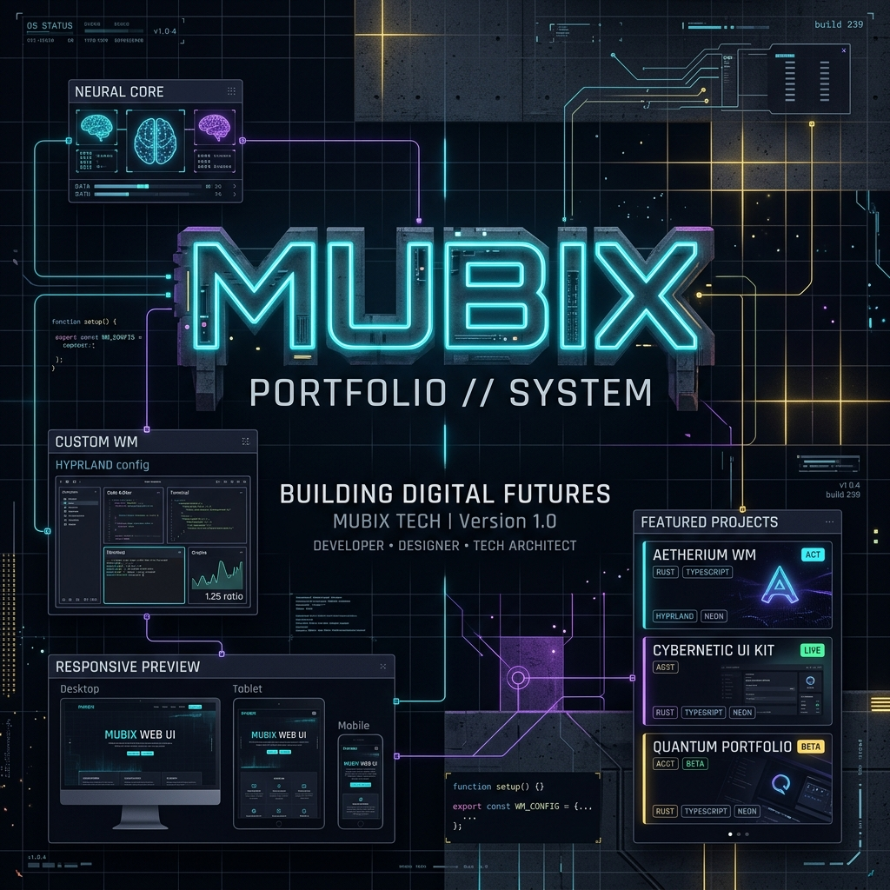
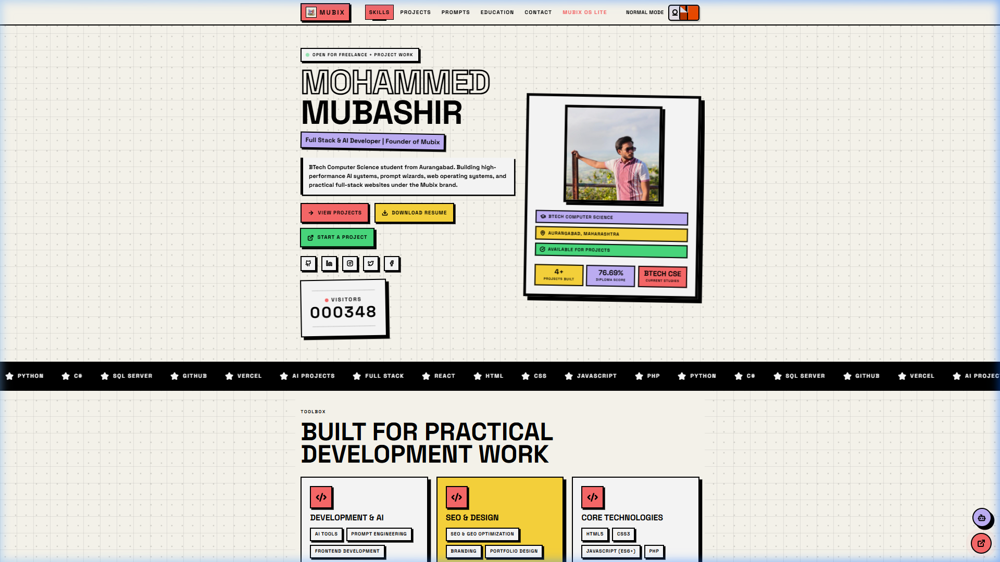
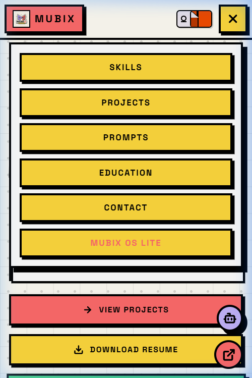
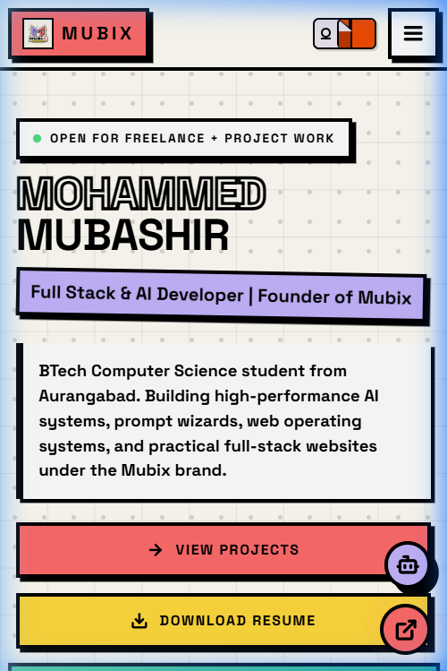
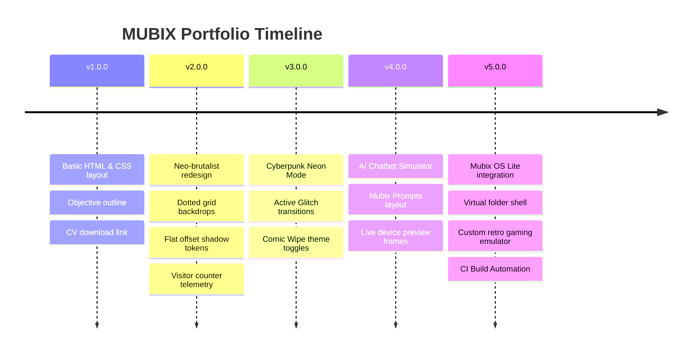

<p align="center">
  
</p>

<p align="center">
  
</p>

<h1 align="center">⚡ MUBIX PORTFOLIO ⚡</h1>

<p align="center">
  <strong>Creative brutalist developer portfolio with cyberpunk mode, AI chatbot, interactive UI, and futuristic web experiences.</strong>
</p>

<p align="center">
  <a href="https://github.com/mubashirsys-dev/Mubix/stargazers"></a>
  <a href="LICENSE"></a>
  <a href="https://mubix.in"></a>
  <a href="https://vercel.com"></a>
</p>

<p align="center">
  <a href="https://mubix.in" style="font-size: 1.25rem; font-weight: bold; color: #00ffcc; text-decoration: none; border: 2px solid #00ffcc; padding: 10px 20px; background: #0d0b11; border-radius: 4px; box-shadow: 4px 4px 0px #ff007f;">🚀 OPEN PORTFOLIO (mubix.in)</a>
</p>

---

## 📖 Project Overview & Philosophy

**MUBIX** is more than just a typical developer portfolio; it is an interactive web-based digital product designed to push the boundaries of modern front-end styling and AI-powered simulation. 

Built under the **Mubix** brand by **Mohammed Mubashir**, a BTech Computer Science developer based in Aurangabad, India, the site acts as an experimentation laboratory for:
* **Creative Developer Identity**: Breaking the mold of plain, boring portfolio templates.
* **Modern UI Paradigms**: Integrating high-contrast **Neo-Brutalist Layouts** with **Futuristic Cyberpunk Neon aesthetics**.
* **Interactive AI Capabilities**: Offering real-time feedback loops and chat telemetry.
* **Bundle Optimization**: Compiling 1500+ modules down to lightweight, fast-loading distribution assets.

---

## 📺 Premium Visuals & Screenshot Showcases

### 🌓 Dual Themes: Minimalist Brutalist vs. Cyberpunk Mode

<table>
  <tr>
    <td width="50%">
      <p align="center"><strong>Standard Light Brutalist Mode</strong></p>
      
    </td>
    <td width="50%">
      <p align="center"><strong>Cyberpunk System Mode</strong></p>
      
    </td>
  </tr>
</table>

### 💬 Client-Side AI Chatbot & Responsive Design

<table>
  <tr>
    <td width="50%">
      <p align="center"><strong>Interactive Developer Chatbot</strong></p>
      
    </td>
    <td width="50%">
      <p align="center"><strong>Mobile Responsive Adaptability</strong></p>
      
    </td>
  </tr>
</table>

---

## ⚡ Core Features

* 🌓 **Dual Theme Engine**: Fast-swapping design tokens between modernist cream brutalism and neon-lit cyber-hacker schemes.
* 💥 **Immersive Transitions**: Active custom theme changes featuring comic book paper wipes and scanline glitch filters.
* 🤖 **AI Chatbot Simulator**: Interactive virtual assistant replying with customizable response trees.
* 📊 **Live Hit Counter**: Direct telemetry integrations recording and displaying visitor stats in real-time.
* 💻 **MUBIX OS Environment**: Browser-simulated operating system sandbox featuring snake games, terminal neofetch commands, and custom text editors.
* 📱 **Mobile-First Responsiveness**: Handheld-adjusted grid configurations keeping text readable across tiny viewports.
* 🖱️ **Tactile Micro-animations**: Active spring offsets on brutalist cards, hovering tags, and cursor tracking.

---

## 🛠️ Technology Stack

### Front-end Layout & State
<p>
  
  
  
  
  
</p>

### Dynamic Integrations & Back-end
<p>
  
  
  
</p>

### Versioning & Deployments
<p>
  
  
  
</p>

---

## 🚀 Getting Started & Installation

Follow these steps to configure and boot the MUBIX Portfolio on your local development system.

### Prerequisites
Make sure you have Node.js (version 18 or higher) and npm installed:
```bash
node -v
npm -v
```

### 1. Clone the Repository
```bash
git clone https://github.com/mubashirsys-dev/Mubix.git
cd Mubix
```

### 2. Install Project Dependencies
```bash
npm install
```

### 3. Spin Up Local Server
Launch Vite's dev server:
```bash
npm run dev
```
The console will output the active address, typically:
`http://localhost:5173/` or `http://127.0.0.1:5173/`

### 4. Build for Production
To compile and optimize assets for deployment:
```bash
npm run build
```
Production assets compile inside the `dist/` directory, ready to deploy to host platforms like Vercel or Netlify.

---

## 📈 Release Roadmap & Version Milestones



### 🔮 Future Milestones
- [ ] **CMS Integration**: Move resume data and project portfolios from hardcoded JS arrays into a dynamic web database.
- [ ] **Advanced AI Contexts**: Integrate real LLM API responses into the Chatbot.
- [ ] **Portfolio API**: Expose structured JSON endpoints for developer portfolio telemetry.
- [ ] **System Dashboard**: Admin logs tracking visitor locations and counter clicks.

---

## 🤝 Community Compliance

* **License**: Open-source MIT License. Review [LICENSE](LICENSE) for terms.
* **Contributing**: We welcome PRs! Read [CONTRIBUTING.md](CONTRIBUTING.md) for coding styles and pull request checklists.
* **Behavior Standards**: Contributor Covenant [CODE_OF_CONDUCT.md](CODE_OF_CONDUCT.md) applies.
* **Vulnerability Reporting**: See [SECURITY.md](SECURITY.md) to report vulnerabilities safely.

---

<p align="center">
  <strong>Mohammed Mubashir (MUBIX)</strong><br>
  Aurangabad, Maharashtra, India<br>
  <a href="https://instagram.com/mubashir.o_0">Instagram</a> • <a href="https://www.linkedin.com/in/mohammed-mubashir-aa62a440a">LinkedIn</a> • <a href="https://github.com/mubashirsys-dev">GitHub</a>
</p>

<p align="center">
  <sub>Built with creativity, code, and high-performance Neo-brutalism. © 2026 MUBIX.</sub>
</p>
