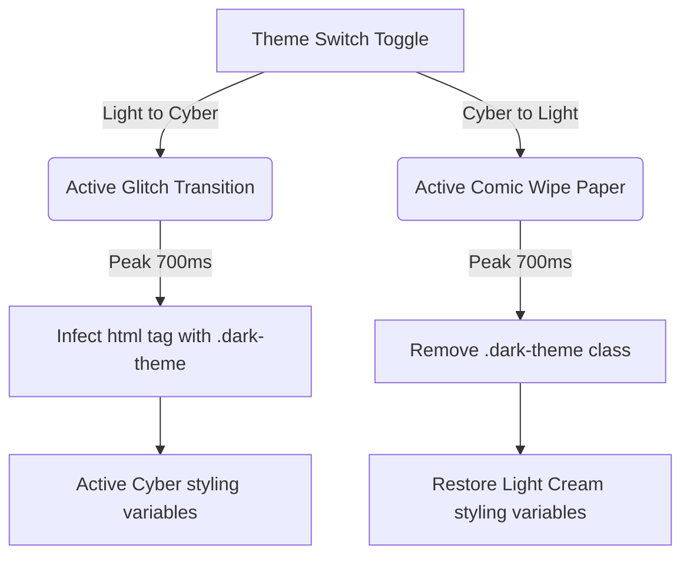

# Codebase Architecture

This document describes the design patterns, folder hierarchy, styling systems, and execution flows within the MUBIX Portfolio application.

---

## 🏗️ Folder Structure

```text
root/
│
├── .github/                 # GitHub repository automation config files
│   └── workflows/           # CI pipelines (build validation)
│
├── assets/                  # Documentation header images, banners
│   └── banner.png
│
├── public/                  # Static assets hosted directly
│   ├── resume/              # PDF and previews of Mohammed Mubashir's resume
│   └── logo.jpeg
│
├── screenshots/             # Interface captures (Light/Cyber themes, chatbot)
│
├── src/                     # React application source code
│   ├── components/          # Reusable JSX layouts & components
│   │   ├── BrutalCard.jsx       # Brutalist layout element
│   │   ├── Chatbot.jsx          # AI assistant window simulation
│   │   ├── MubixOsLanding.jsx   # Mubix OS desktop dashboard
│   │   ├── MubixPromptsShowcase.jsx # AI Prompts Engine scaled device mockup
│   │   └── ThemeToggle.jsx      # Theme trigger handler
│   │
│   ├── data/                # Hardcoded database schemas and templates
│   │   ├── chatbotData.js       # Predefined chat replies
│   │   └── resume.js            # Profile resume structured data
│   │
│   ├── App.jsx              # Main router & page layout composer
│   └── main.jsx             # React entry point mounts to index.html
│
├── docs/                    # Technical brief files & maps
│   ├── architecture.md
│   └── README.md
│
├── vite.config.js           # bundler compilation configurations
└── package.json             # dependencies and execution scripts
```

---

## 🎨 Theme & Transition Pipeline

The portfolio operates on a dual theme state: `light` (Brutalist Modernist) and `dark` (Futuristic Cyberpunk Neon). The theme management is driven by `React.useState` in `src/App.jsx` and injected as a class name `.dark-theme` on the `<html>` node.



### Transition Modes

1. **Cyber Glitch (Light ➔ Cyber)**
   - Triggers an overlay element with high-skewed noise scanlines and an immersive terminal-override red layout.
   - Transitions in `1500ms`.

2. **Comic Wipe (Cyber ➔ Light)**
   - Animates a set of solid overlapping diagonal panels that translate across the screen to wipe away the dark mode.
   - Completes in `1600ms`.

---

## ⚙️ Core Subsystem Details

### 🤖 1. AI Prompts Compilation Simulator
- Emulates a structured compiler translating natural language system prompts into live mockups.
- Controls scaled CSS boxes inside a simulator frame. It scales dynamically using a `ResizeObserver` tracking the viewport parent container to prevent overflow.

### 💻 2. MUBIX OS Shell Sandbox
- Emulates desktop window multitasking, simulated file tree structure creation/deletion, a command shell neofetch reader, and custom canvas-based retro gaming.

### 💬 3. Developer Assistant Chatbot
- Emulates instant chat support using pre-programmed arrays with keyword classification matching visitor inquiries.
